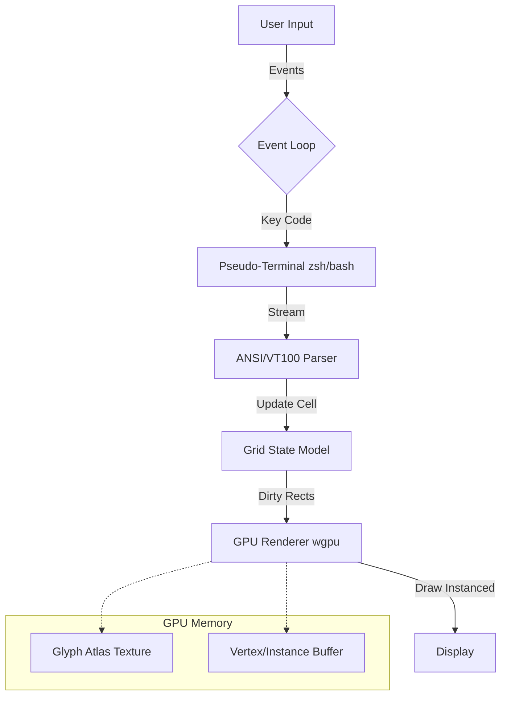

# Adamant: The Unbreakable Terminal
Adamant is a high-performance, GPU-accelerated terminal emulator written in Rust.
It is built on the philosophy that a developer's primary tool should be as fast as a game engine and as reliable as a diamond.
> Status: Pre-Alpha (Construction Phase)
> Motto: "Don't configure it. Compile it."


💎 Why Adamant?

世の中には Alacritty, WezTerm, Kitty など素晴らしいターミナルが存在します。しかし、それらは「汎用品」です。
Adamant は、以下の目的のために設計された「あなた専用の」最強のシェル環境です。
 * Hypersonic Rendering: 最新のグラフィックスAPI (Vulkan/Metal/DX12) を wgpu 経由で直接叩き、4K/120fps 環境でもドロップフレームゼロを目指します。
 * Game Engine Architecture: テキスト表示を「2Dスプライトの大量描画」と捉え、ゲーム開発のノウハウ（インスタンシング、アトラス化）を投入しています。
 * Code-First Configuration: 設定ファイル（YAML/TOML）のパースなどという「遅い」処理は行いません。設定はすべて Rust の構造体としてコンパイルされ、バイナリの一部となります。


🏗 Architecture
Adamant は、MVCモデルではなく、ゲームループに近いアーキテクチャを採用しています。



Core Components
 * The Shell Interface (PTY): portable-pty を使用し、OSのシェルプロセスと非同期通信を行います。
 * The State Grid: 画面上の文字情報（Unicode Char, FG/BG Color, Attributes）を管理するリングバッファ。
 * The Renderer: wgpu を使用したレンダリングエンジン。
   * Glyph Atlas: 使用されるフォントグリフを動的にテクスチャにパッキングします。
   * Instancing: すべての文字を1回のドローコールで描画するためのインスタンシング技術。

🛠 Tech Stack
 * Language: Rust (2021 edition)
 * Graphics: wgpu (WebGPU implementation in Rust)
 * Windowing: winit
 * Font Shaping: swash or rustybuzz (HarfBuzz port)
 * Async Runtime: pollster (Minimal blocking executor) or tokio
 * PTY: portable-pty

🔥 Technical Challenges

1. Dynamic Glyph Atlas Management
フォントのラスタライズは重い処理です。Adamant は一度レンダリングした文字（'A', 'あ', '🍺'）を GPU 上の巨大なテクスチャ（アトラス）にキャッシュします。
アトラスが満杯になった時の LRU (Least Recently Used) キャッシュ置換アルゴリズムの実装が肝となります。

2. Unicode Complexity (Text Shaping)
単純に文字を並べるだけでは不十分です。
 * Ligatures: -> を → に変える合字処理。
 * Grapheme Clusters: 👨‍👩‍👧‍👦 (家族の絵文字) のような、複数のコードポイントで1文字を構成する処理。
 * Wide Characters: 全角文字（2セル消費）の厳密な幅計算。

3. Latency Minimization
キーを押してから画面が光るまでの遅延（Input-to-Photon Latency）を極限まで削ります。
垂直同期（VSync）の制御や、イベントループの優先順位付けにより、人間の知覚限界に挑みます。

## 🗺 Roadmap

Phase 1: The Window & The Quad (Rendering Core)
 * [ ] winit でウィンドウを表示する。
 * [ ] wgpu パイプラインをセットアップする。
 * [ ] シェーダー（WGSL）を書き、画面に矩形を表示する。
 * [ ] インスタンシングを実装し、1万個の矩形を 60fps で描画する。

Phase 2: The Text Engine (Font)
 * [ ] フォントファイルを読み込む。
 * [ ] グリフをラスタライズし、テクスチャアトラスを動的に生成する。
 * [ ] 矩形にテクスチャをマッピングし、「文字」として表示する。

Phase 3: The Terminal Logic (PTY & ANSI)
 * [ ] バックグラウンドで zsh / bash を起動する。
 * [ ] キー入力を PTY に送る。
 * [ ] PTY からの出力を受け取り、簡易的な表示を行う。
 * [ ] VT100 / ANSI エスケープシーケンス のパーサーを実装する（色、カーソル移動）。

Phase 4: The "Adamant" Polish
 * [ ] IME (日本語入力) のサポート。
 * [ ] シェーダーによるポストエフェクト（Bloom, Retro CRT scanlines）。
 * [ ] tmux / vim での動作確認と最適化。
🚀 Getting Started
これは開発者向けのプレビュー手順です。

# Clone the repo
```
git clone https://github.com/matuyuhi/adamant.git
cd adamant
```

# Run in debug mode (Wait, it might be slow)
```
cargo run
```

# Run in release mode (The Speed of Light)

```
cargo run --release
```

🤝 Contribution
Adamant は「俺が使う最強の道具」ですが、コードはオープンです。
パフォーマンスの改善案、シェーダーの魔改造、あるいは「このANSIシーケンスが動かないぞ」という報告を歓迎します。
ライセンス

MIT License
